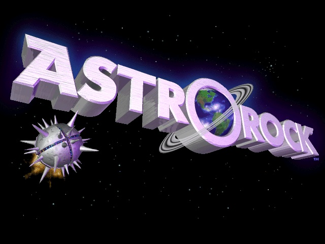

# AstroRock

A Rust port of **AstroRock**, the 1995–97 Windows 95 DirectDraw
asteroids game by Lars Brubaker — rebuilt on
[agg-gui](https://github.com/larsbrubaker/agg-gui), running native
(Windows/macOS/Linux) and in the browser via WebAssembly.

[](https://larsbrubaker.github.io/AstroRock/)

**▶ Play it:** https://larsbrubaker.github.io/AstroRock/

## Status

Playable port in progress. The single-player loop is live — ship,
weapons, rocks, all five enemy types, goodies, the stat bar HUD,
intermission bonuses, sound and music — with the remaining systems
ported phase by phase from the original C++ (see `todo.md`). The port
is deterministic-faithful: the original's f32 expression shapes, RNG,
and 30 Hz lockstep are reproduced exactly so recorded demos can replay
as the regression suite.

## Building

Requires the [agg-gui](https://github.com/larsbrubaker/agg-gui) repo
checked out as a sibling directory (`../agg-gui`).

```powershell
cargo run -p astrorock-native      # desktop
cargo test --workspace             # tests
```

Web build:

```powershell
wasm-pack build astrorock-wasm --target web --out-dir ../demo/public/pkg --no-typescript
cd demo; bun install; bun run dev
```

## License

Code is MIT licensed. Game art, sounds, and music are
© 1995–2026 Lars Brubaker; included for use with this game.
